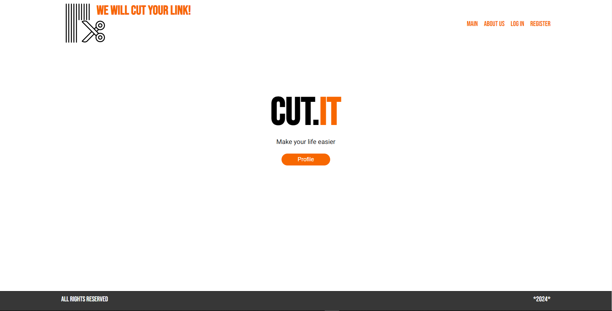
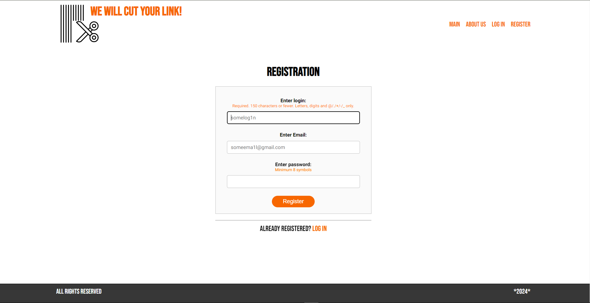
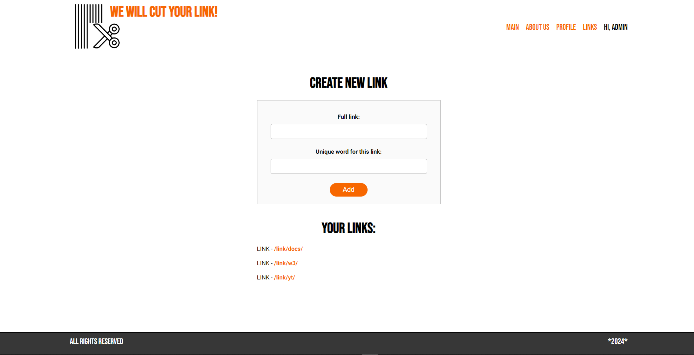

# My graduation project

The essence of my project is link clipping (we insert a link and a code word, and at the output we get a link shortened by the code word). 

The page includes: 
- authorization and registration system with DB;
- several static pages (homepage, about us);
- dynamically updated and stored in the database links, entered by specific users.

## Technologies:








## Project launch:
* Clone the project to your computer from Github using the command:
```
git clone https://github.com/https://github.com/kirchman1/Diploma-cut.it.git
```

*Launch the project using the command:
```
python manage.py runserver
```
